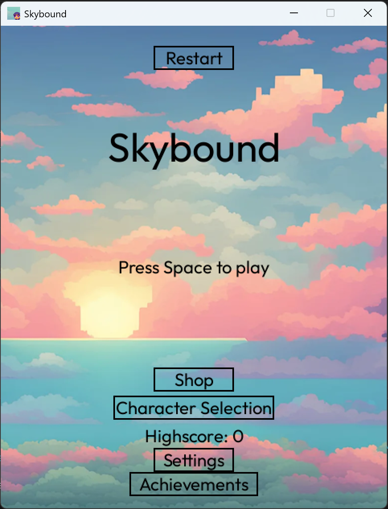
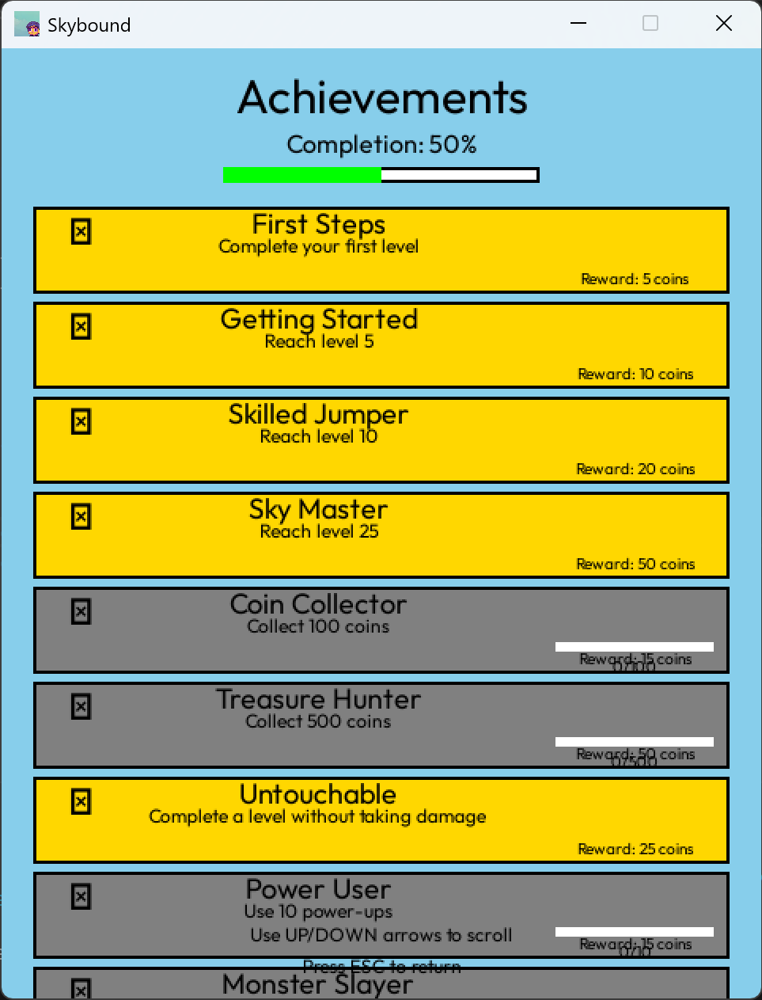
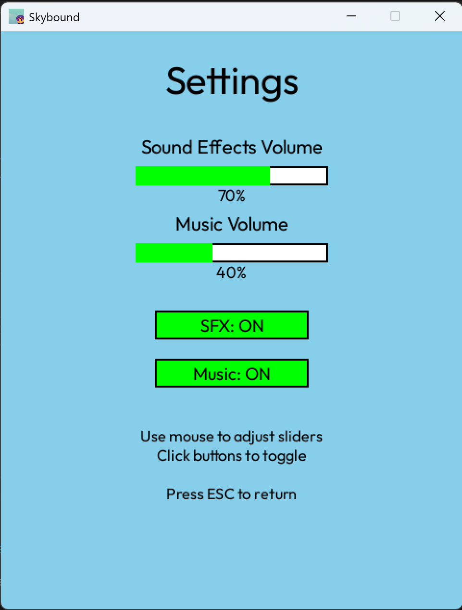
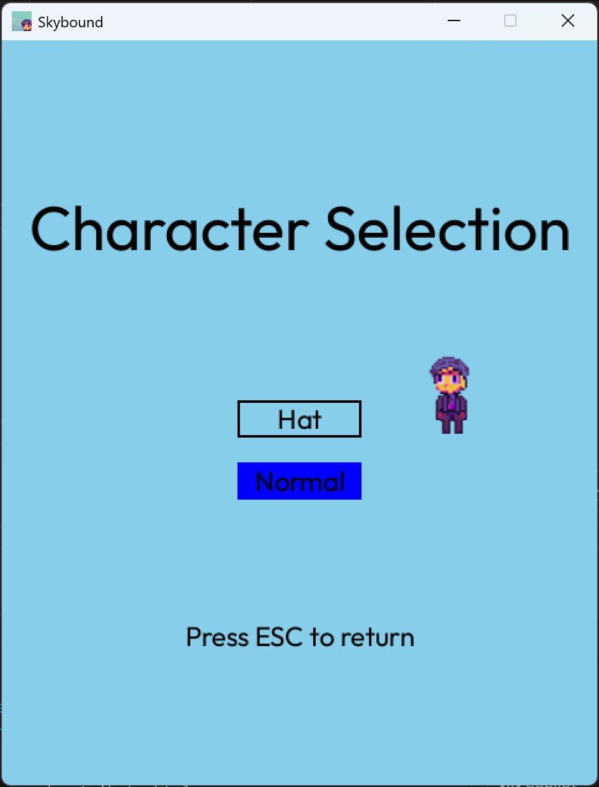
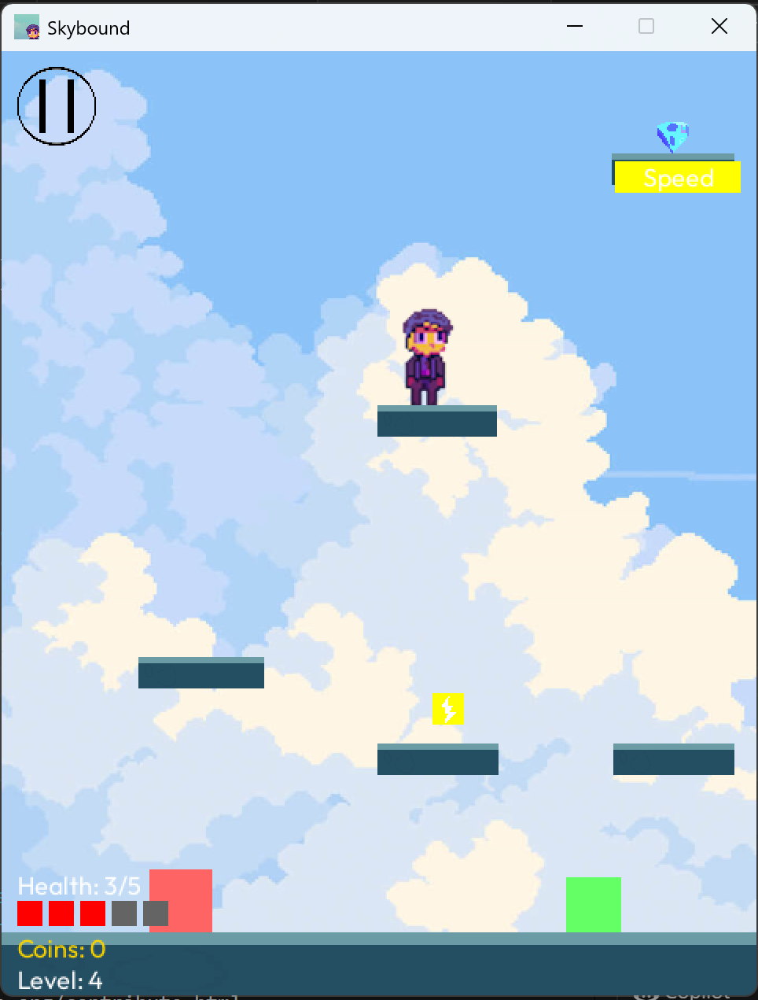
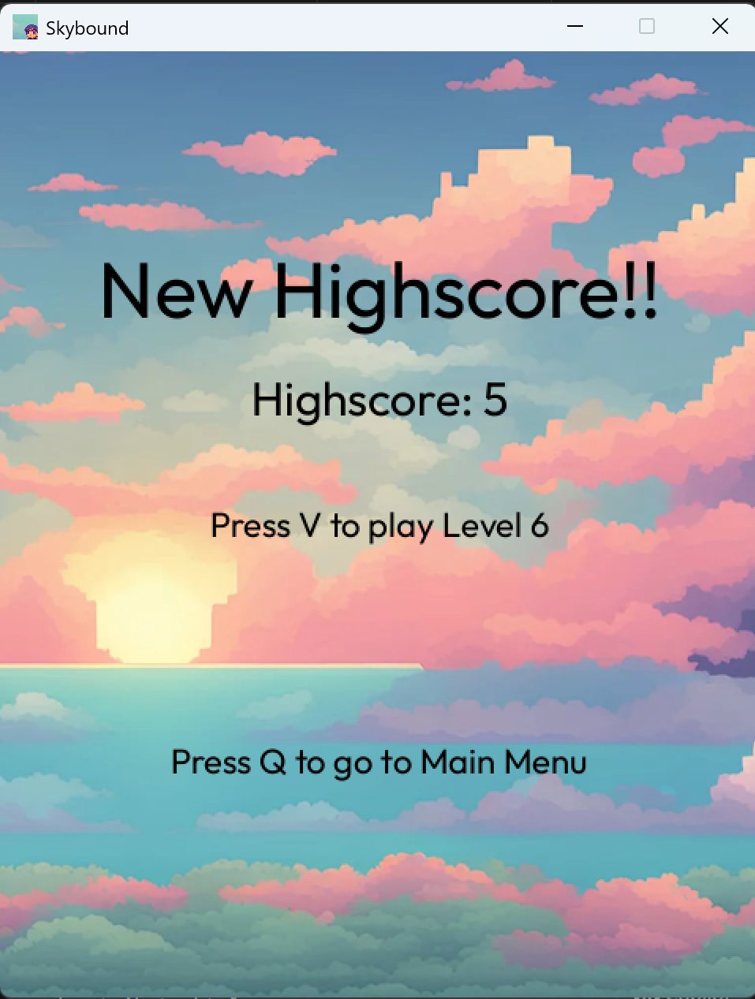
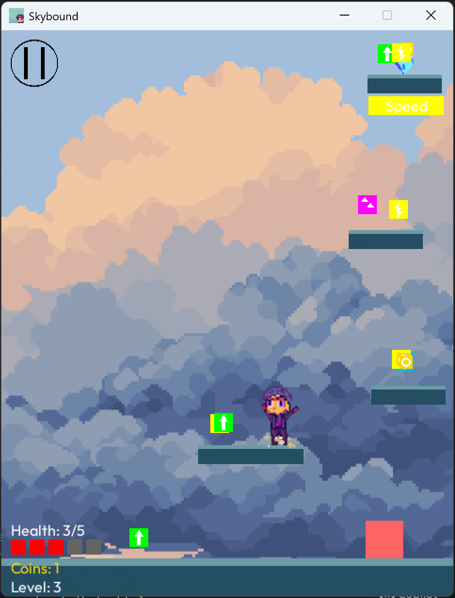
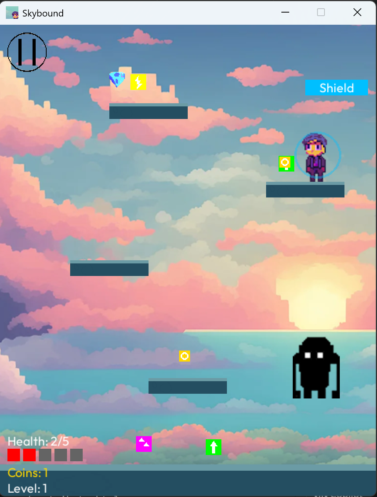

Skybound 2.0

A 2D platformer built with Python and Pygame with procedural level generation, multiple enemy characters, multiple states, power-ups and achievements.
Straight up run main.py or run pyinstaller skybound.spec for the included build system

<table>
  <tr>
    <td></td>
    <td></td>
    <td></td>
  </tr>
</table>

<table>
  <tr>
    <td></td>
    <td></td>
    <td></td>
  </tr>
</table>

<table>
  <tr>
    <td></td>
    <td></td>
  </tr>
</table>


Setup Instructions

1. Clone the repository:
   ```
   git clone https://github.com/AxelSuu/Skybound-2.0
   cd Skybound
   ```

2. Install the required dependencies:
   ```
   pip install -r requirements.txt
   ```

3. Run in code
   ```
   python3 main.py
   ```

3. Alternative, Build the exe file
   ```
   pyinstaller skybound.spec
   ```

I took the background images from here
[Background images](https://craftpix.net/freebies/free-sky-with-clouds-background-pixel-art-set/)


