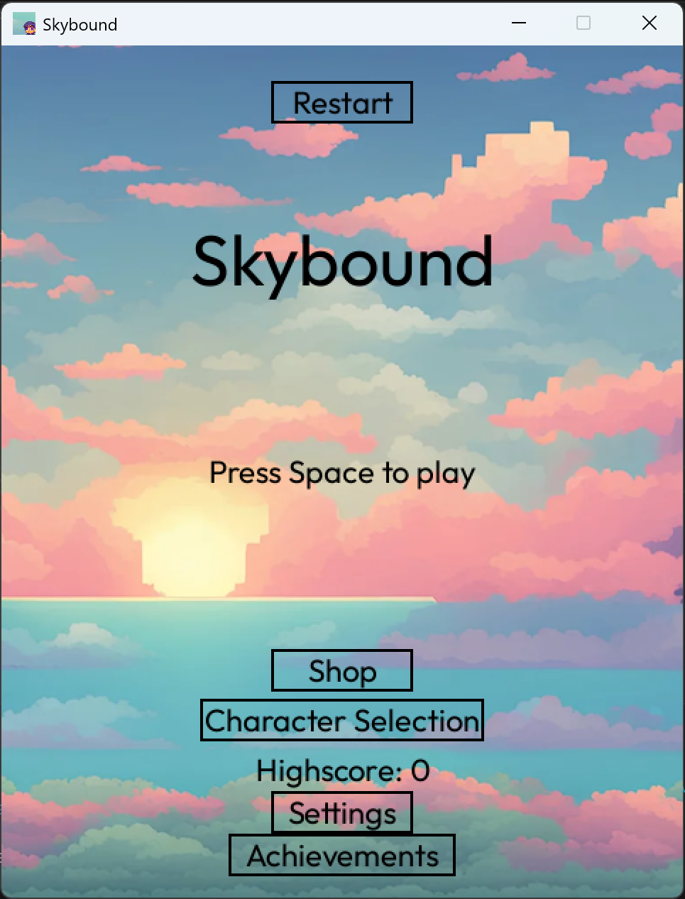
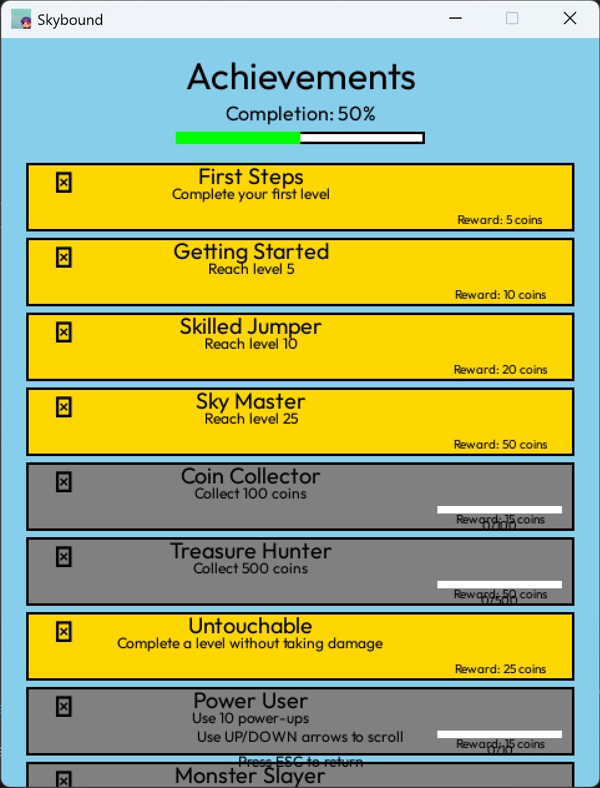
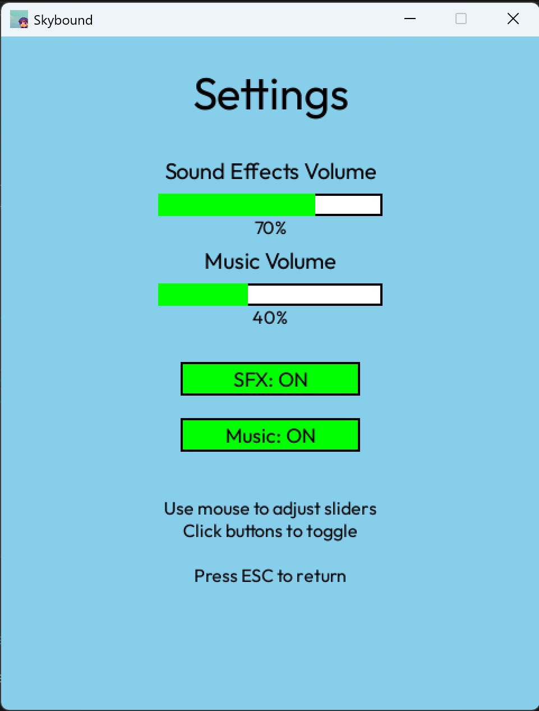
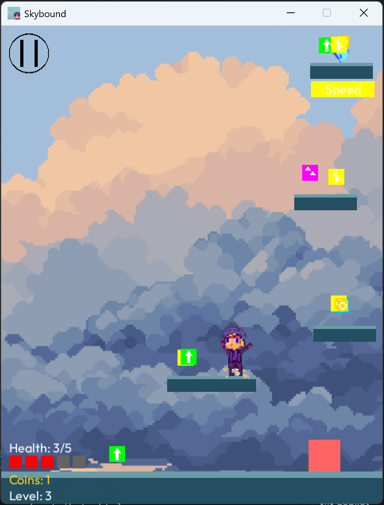
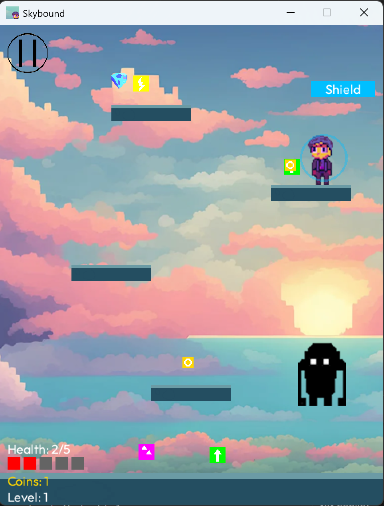

Skybound 2.0

A 2D platformer built with Python and Pygame-ce with procedural level generation, multiple enemy characters, multiple states, power-ups and achievements.
Straight up run 
```
uv run python main.py
``` 
or run 
```
uv run --group build pyinstaller skybound.spec
``` 
for the included build system to OS agnostically build an exe

<table>
  <tr>
    <td></td>
    <td></td>
    <td></td>
  </tr>
</table>

<table>
  <tr>
    <td></td>
    <td></td>
  </tr>
</table>


Setup Instructions

1. Clone the repository:
   ```
   git clone https://github.com/AxelSuu/Skybound-2.0
   cd Skybound
   ```

2. Install [uv](https://docs.astral.sh/uv/) if you don't have it, then sync the dependencies:
   ```
   uv sync
   ```
   This creates a virtual environment and installs the exact pinned versions from `uv.lock`.

3. Run in code
   ```
   uv run python main.py
   ```

4. Alternative, Build the exe file (installs the optional build tools):
   ```
   uv run --group build pyinstaller skybound.spec
   ```

I took the background images from here
[Background images](https://craftpix.net/freebies/free-sky-with-clouds-background-pixel-art-set/)


