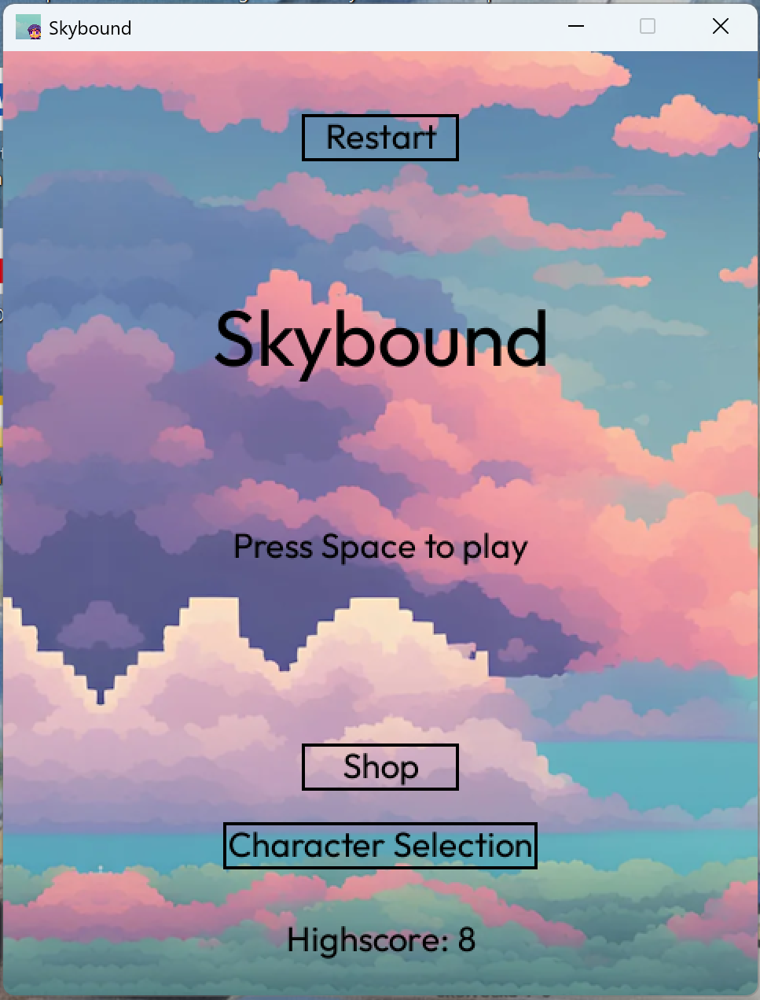
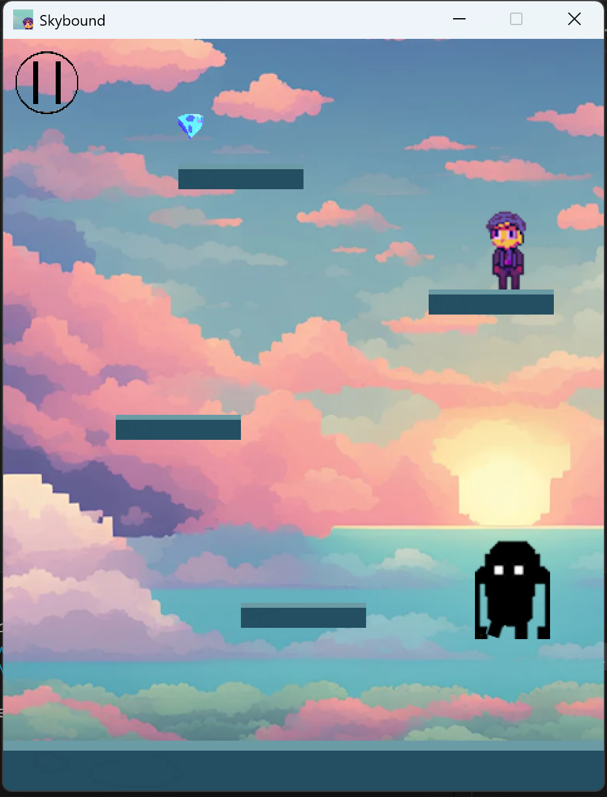
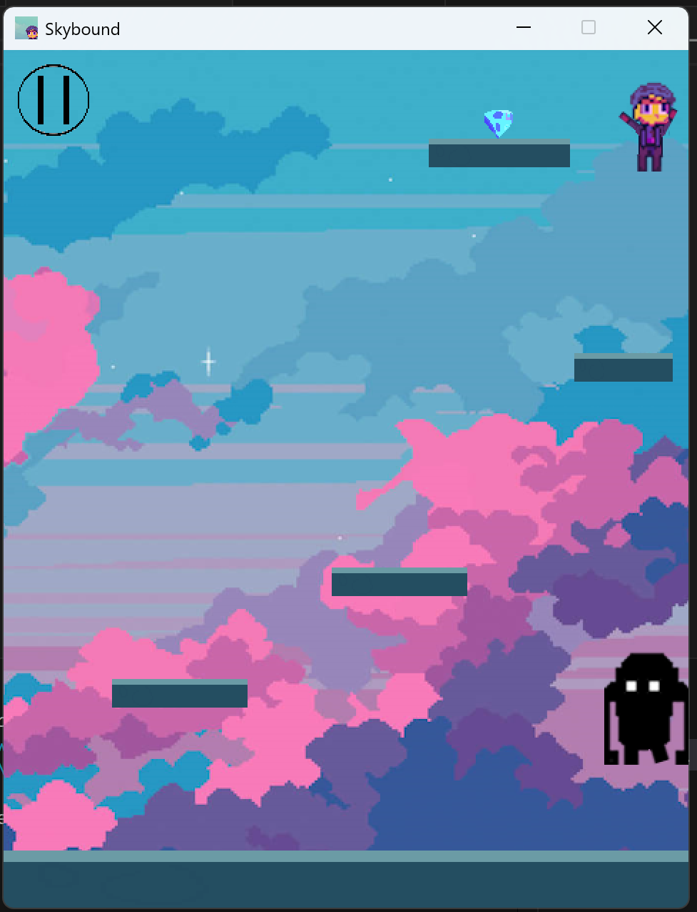
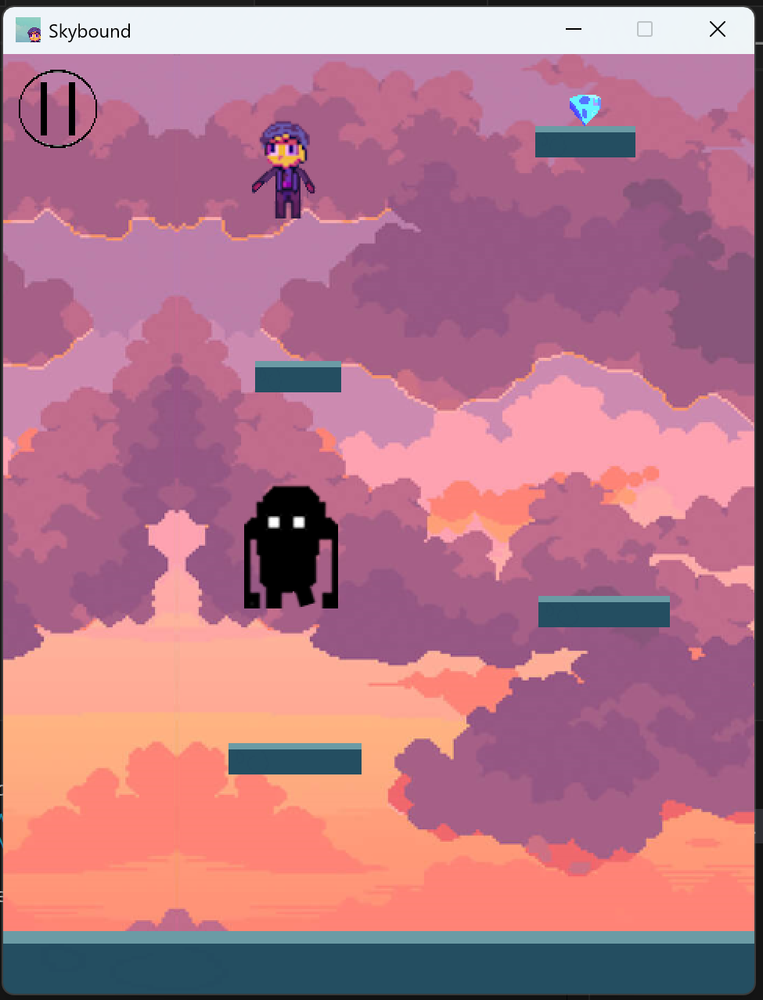

# Skybound 2.0 - 2D Platformer Game

A feature-rich 2D platformer game built with Python and Pygame, featuring procedural level generation, power-ups, achievements, and comprehensive visual effects.

<table>
  <tr>
    <td></td>
    <td></td>
    <td></td>
    <td></td>
  </tr>
</table>

## Enhanced Features

### Core Gameplay
- **Physics-based movement** with acceleration and friction
- **Procedural level generation** with increasing difficulty
- **Multiple enemy types** with unique AI behaviors  
- **Power-up system** with temporary and permanent upgrades
- **Health and damage system** with invincibility frames
- **Coin collection** and persistent statistics

### Visual Effects
- **Particle systems** for explosions, trails, and ambient effects
- **Screen shake** for impact feedback
- **Floating text** for damage numbers and notifications
- **Power-up indicators** and visual feedback
- **Smooth animations** for all characters and objects

### Audio
- **Dynamic background music** that changes with game state
- **Procedural sound effects** for actions and collisions
- **Spatial audio** with distance-based volume

### Progression Systems
- **Achievement system** with 15+ unique achievements
- **Persistent player statistics** across sessions
- **Character customization** with unlockable hats
- **High score tracking** and level progression

## Original Features
- **State Management**: Multiple game screens (Menu, Start, Game, Pause, Game Over)
- **Fluid Animations**: Character animations using spritesheets with JSON metadata
- **Dynamic Audio**: Different background music for each game state
- **Enemy movement logic**: Several NPC monster with different behaviors
- **Procedural Generation**: Infinite, random level creation
- **Shop System**: In-game store with unlockable characters
- **Persistent Storage**: Save high scores and character selections
- **Cross-Platform**: Works on Windows, Mac, and Linux
- **A simple database** for storing highscore, player selection, etc with homemade API functionality.
- **46 MB executable** with pyinstaller instructions
- **Documented** according to PEP-8 (ish) and well structured.


## Controls
- **Space/Up Arrow**: Jump
- **Left/Right Arrow**: Move left/right

## Setup Instructions

1. Clone the repository:
   ```
   git clone https://github.com/AxelSuu/Skybound
   cd Skybound
   ```

2. Install the required dependencies:
   ```
   pip install -r requirements.txt
   ```

3. Build the application
   ```
   pyinstaller skybound.spec
   ```
4. Or run in code
   ```
   python3 main.py
   ```


## Project structure
```
Skybound
├── main.py                # Main entry point, manages game states and music
├── imgs                   # Image assets directory
│   ├── Playersheet.png    # Player sprite sheet
│   ├── Playersheet.json   # Player sprite metadata
│   ├── Mobsheet.png       # Enemy sprite sheet
│   ├── Mobsheet.json      # Enemy sprite metadata
│   ├── Sky2.png           # Background image
│   ├── Freesky*.png       # Additional background variations
│   ├── icon.png           # Game icon
│   ├── hat1.png           # Hat accessory
│   ├── hat2.png           # Additional hat accessory
│   ├── paus.png           # Pause button image
│   ├── plat3.png          # Platform image
│   ├── goal2.png          # Goal object image
│   └── IdleL2.png         # Default player sprite
├── sfxs                   # Sound effects and music
│   ├── music1.ogg         # Highscore screen music
│   ├── music5.ogg         # Gameplay music
│   └── music7.ogg         # Menu music
├── font                   # Font assets
│   └── Outfit-Regular.ttf # Main game font
├── txts                   # Game state and player data storage
│   ├── Char_selection.txt # Selected character
│   ├── Gamestate.txt      # Current game state
│   ├── Hat.txt            # Hat ownership status
│   ├── Highscore.txt      # Player's high score
│   ├── level.txt          # Current game level
│   └── Score.txt          # Current score
├── utils                  # Utility modules
│   ├── __init__.py
│   ├── database_logic.py  # Functions for reading/writing game state
│   ├── draw_text.py       # Text rendering utility
│   └── spritesheet.py     # Sprite sheet parsing functionality
├── sprites                # Game object classes
│   ├── __init__.py
│   ├── goal.py            # Level goal object
│   ├── mob.py             # Enemy character
│   ├── pausebutton.py     # Pause interface button
│   ├── platform.py        # Platform object
│   └── player.py          # Player character with animations
├── windows                # Game screens/states
│   ├── __init__.py
│   ├── gameover.py        # Game over screen
│   ├── main_menu.py       # Main menu with shop & character selection
│   ├── new_highscore_screen.py # High score celebration screen
│   ├── paus.py            # Pause screen
│   └── start.py           # Game start screen
├── levels                 # Level generation
│   ├── __init__.py
│   └── level1.py          # Level creation and procedural generation
├── gameloop               # Main gameplay loop
│   ├── __init__.py
│   └── loop.py            # Game update, rendering and collision detection
├── README.md              # Project documentation
└── requirements.txt       # Project dependencies
```

## Functionality to add:
- Background shaders, web version port

## I took the background images from here
[Background images](https://craftpix.net/freebies/free-sky-with-clouds-background-pixel-art-set/)


## Contributing

Feel free to submit issues or pull requests for improvements or bug fixes.
